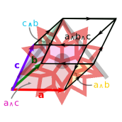

<p align="center">
  
</p>

# Grassmann.wl

*⟨Leibniz-Grassmann-Clifford-Hestenes⟩ differential geometric algebra / multivector simplicial complex*

This repository is an official Wolfram language variation of the [Grassmann.jl](https://github.com/chakravala/Grassmann.jl) library originally implemented in the Julia language.
Currently, this is a casual work in progress.

To make this paclet visible to the system, install this repository to an Applications folder:
```wolfram
PacletDirectoryLoad[FileNameJoin[{$UserBaseDirectory, "Applications", "Grassmann.wl"}]]
```
Code from package can be loaded with ``Needs["Grassmann`"]`` or ``Get["Grassmann`"]`` to initialize.

Preliminary usage information can be found in the WSS21 post [Foundations of differential geometric algebra package](https://community.wolfram.com/groups/-/m/t/2314523) before the documentation is created. This post is currently outdated, as the exterior product and geometric product are now implemented in this repository. Updated documentation will be created soon, as finishing touches are ironed out.
